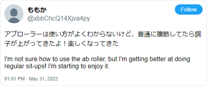
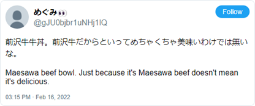
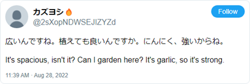
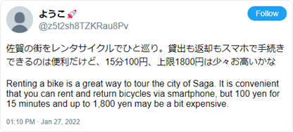
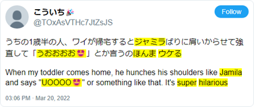
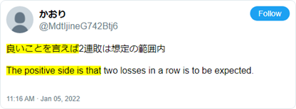

# BERT for Sentiment Analysis of Japanese Twitter

 
    Sentiment analysis, alternatively called opinion mining, is practiced by businesses, academia, and policymakers who aim to understand public sentiments as expressed through language. This field utilizes NLP to analyze large volumes of data from digital platforms where users frequently share their opinions (Liu, 2012). The rise of social media has significantly boosted the relevance of sentiment analysis by providing vast amounts of data on public opinion in real time (Dave et al., 2003). Organizations use sentiment analysis to evaluate consumer reactions and adjust their strategies accordingly (McGlohon et al., 2010). Sentiment analysis helps businesses understand customer satisfaction and guide product development (Hong & Skiena, 2010). In social media contexts, sentiment analysis helps identify trends and shifts in public mood, which is informative for marketing and public engagement (Mohammad, 2012). Therefore, sentiment analysis is a powerful tool for any entity interested in gauging and responding to public opinion online.

    Sentiment analysis operates at three levels: document, sentence, and aspect (Liu, 2012). Document-level analysis assesses the overall sentiment of entire texts, such as reviews or articles. Sentence-level analysis classifies the sentiment of individual sentences, while aspect-level analysis focuses on the specific subjects of opinions and their sentiments.   This project concentrates on document-level analysis, classifying tweets into one of four categories—positive, negative, neutral, or mixed. Classifications represent the feelings of the author of the tweet. The four categories are exemplified in Figures 1.1 to 1.4.

    Current state-of-the-art models utilize contextualized encodings derived from Transformers (Vaswani et al., 2017). The BERT architecture, which relies solely on Transformers, has proven to be highly effective across tasks (Devlin et al., 2019). This thesis introduces BERT for Japanese Twitter, which was adapted from Japanese BERT by continuing pre-training on a Twitter corpus. A lightweight training set, Japanese Twitter Sentiment 1k (JTS1k), was developed for the target task. JTS1k, in conjunction with another dataset, were used to fine-tune BERT for Japanese SNS Sentiment, a sentiment classifier that generalizes across social network services (SNS). This approach leverages transfer learning, following a leading paradigm in NLP (Ruder et al., 2019).

 
 ## Ethical Considerations
    This project used the Twitter API to access tens of millions of tweets for training models. The data included identifiable information like usernames and profile details. Twitter’s terms and conditions limit sharing to ID numbers only, although limited exchanges of text and user data among colleagues is allowed. In line with these rules, this project released its training dataset using only IDs and excluded any text data. This thesis occasionally references specific Twitter posts. While these posts are genuine, identifying details such as usernames and timestamps have been substituted with random generations. The ethical standards in research stress the importance of consent when using identifiable data (Association of Internet Researchers, 2019; Sloan et al., 2020). This thesis acknowledges the need for consent and complies with Twitter’s guidelines.

  
  
<em>Positive tweets express emotions such as joy, satisfaction, optimism, or anticipation. Mixed emotions are considered positive if the positive emotions are dominant.</em>

  
  
<em>Negative tweets express emotions such as anger, sadness, disappointment, or fear. Mixed emotions are considered negative if the negative emotions are dominant.</em>

  
  
<em>Neutral tweets express balanced or indifferent emotions, with no strong positive or negative sentiments. Examples include stating a fact, asking a question, or seeking a recommendation.</em>

  
  
<em>Mixed tweets express both a clear positive and negative opinion, and it is unclear which one is dominant. It might be a balanced presentation of pros and cons, or the simultaneous expression of conflicting emotions.</em>

## Challenges of Japanese Twitter

    Sentiment analysis on Twitter is challenging due to its diverse language usage, which prominently includes slang, abbreviations, misspellings, and emoticons. These elements can significantly vary in meaning depending on the context and the user (Poria et al., 2023).  Additionally, Twitter users often mention named entities, such as brands, people, and locations, which may be central to the underlying sentiment. Moreover, traditional linguistic distinctions like dialectical variation and mimesis are richly represented on social media. This can pose a challenge for BERT models, which are trained and more formal and structured sources like Wikipedia, leaving them less accustomed to the distinctive and impactful language features found on platforms like Twitter.

    Multilingualism adds another layer of difficulty. Japanese Twitter users frequently use English, Chinese, Korean, and other languages. In addition, Twitter users borrow characters from alternative scripts for producing kaomoji . Characters from 55 unique languages were observed across the Twitter corpus. The complexity of model design increases with the need to accommodate multiple language scripts as well as non-standard characters like emojis. The model has a limited vocabulary that is constrained for efficiency. It should be comprehensive enough to cover fundamental Japanese as well as common colloquialisms, neologisms, and multilingual expressions from Twitter. At the same time, it must remain adaptable to new, unseen terms.

  
  
<em>This brief tweet exemplifies several types of expressions that pose challenges for models. ジャミラ refers a giant monster from the popular series Ultraman. うおおおお represents an onomatopoeia for Jamila's roar in Japanese. ほんま is an emphatic term commonly used by speakers of the Kansai dialect, and ウケる, which translates to hilarious, is general slang.</em>

    One of the primary limitations of NLP approaches to sentiment analysis is the loss of context to preprocessing. Tweets are marked by a date, an author, and are bound in conversation by replies and hashtags. Furthermore, Twitter is a multimodal platform that allows users to enrich their posts with media content, including stylized links, photos, and video. In preparing model inputs, the text data is stripped from these critical contexts, shuffled, and transformed into machine-readable form. Sarcasm and irony are particularly challenging because they often rely on subtleties that the model is not exposed to. Current research directions, such as multimodal sentiment analysis, sarcasm awareness, and temporal alignment, are addressing these shortcomings (Poria et al., 2023; Lai et al., 2023; Loureiro et al., 2022). This project overlooks these complexities, solely focusing on the text-based representation of sentiment.

  
  
<em>This tweet was posted with an image of the bio page of a passport, which has been completely covered in scribblings and doodles in permanent marker. The incomplete narrative from the text hints at irony. Without the image, this tweet would be classified as either neutral or positive. With the image, a case could be made for any of the four sentiment classes.</em>

    The communication style in Japanese often uses indirect expressions, making it hard for text-based models to interpret emotions accurately. A fundamental concept in Japanese interaction is 空気を読む (kuuki wo yomu), meaning "read the air." This involves assessing and aligning with the group's mood to maintain harmony. For example, it is customary in Japanese etiquette to modestly deflect compliments to avoid appearing boastful. Emotions, particularly strong ones, are more safely conveyed through factual statements and implicatures rather than direct expressions. While platforms like Twitter provide some anonymity, which invites more direct emotional expression, the traditional indirect style heavily influences communication. This causes models to misclassify tweets, with consistent confusion between negative and neutral sentiments.

  
  
<em>A fan comments on their team’s losing streak, and they use a structure intended for comparison of positive and negative points. By only mentioning a weak positive, overall negative sentiment is implied. This example could potentially fit any of the four sentiment categories.</em>

    A final consideration for working with the Twitter domain is the abundance of automatically generated content. Opinion spamming and content factories are recognized pollutants of web corpora. Additionally, public entities, marketers, and third-party developers have created various tools to interact with the public en masse. Although these functions are innovative and useful, they generate a considerable amount of repetitive text, which poses challenges for language models that favor diverse and meaningful data. Such repetitive texts not only bloat the training material but also risk promoting rote memorization of robotic phrases by language models. This situation can render language models less flexible and less capable of making human-like, context appropriate inferences. Therefore, it is essential to filter out this monotonous content to preserve the quality and effectiveness of the models (Lee, et al., 2022).

