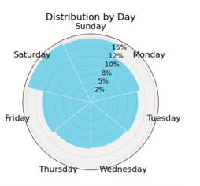
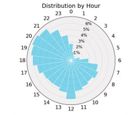

# Building the Training Corpus

 
This chapter describes how Twitter data was acquired using the Twitter API. Different types of data were collected for various stages of development, but the majority was for building a corpus for unsupervised pre-training. Using the Twitter API to select a balanced and representative sample of language is not straightforward. This chapter explores the functionalities of the Twitter API, leading to the querying strategy that was used to build the training corpus. The corpus is evaluated by the diversity of time, place, and user data.

## Limitations of the Twitter API

 
Twitter’s Academic Research tier offered a monthly limit of 10 million tweets, modest when compared to the platform’s daily output of 500 million posts. The corpus created by Barbieri et al. (2022) included 5% Japanese Tweets. If representative, this suggests that Japanese users generate approximately 25 million tweets daily. Beyond the Twitter Sample stream, which distributes 1% of all tweets, the API lacks additional sampling tools. API users can refine searches using parameters targeting specific keywords, accounts, times, among other objective features. To achieve a current and comprehensive view over time, a corpus covering at least a year was desirable. The Full Archive search, permitting access to tweets from any period, was the optimal choice. Two query parameters were used: a language filter selected the target data, and place filter extracted a manageable sample.

## Filters for Targeting and Sampling Tweets

 
The lang operator filters tweets by the language set in user profiles, targeting those in a specified language. Some tweets retrieved with this filter, however, may contain little or no Japanese, highlighting the difficulty in accurately capturing language use. Despite its limitations, the lang operator is a straightforward and effective way to collect Japanese data. Ideally, the model trained on this data should handle multilingual expressions effectively, despite potential noise.
To distribute the quota over the desired timespan, a more specific operator was needed. The place_country operator, which searches for geotagged tweets matching a specified country code, proved useful. Twitter does not automatically geotag posts. Users must opt to share their location, and few do. Combining the lang and place_country operators, the query typically returned an average of 200,000 tweets over 24 hours. The archive was queried using these two operators on consecutive days until the quota was exhausted. This approach continued until access to the Academic Research tier was revoked in May 2023, by which time over 60 million tweets had been collected for the training corpus.

## Corpus Analysis of Time and Place

  
  
<em>Sampling proceeded from June 2022 to May 2023 and included significant contributions from almost every day of this window. The low volume of tweets collected in November 2022 reflects a learning curve in using the API.</em>

  <table>
    <tr>
      <td>
        
      </td>
      <td>
        
      </td>
    </tr>
    <tr>
      <td colspan="2" align="center">
        
<em>The hourly plot (left) shows consistent activity from 7:00-21:00 JCT that wanes and waxes across nighttime hours. The daily plot (right) shows activity over weekdays with a small boost on the weekend. These observations align well with the behavior expected from users living in Japan, validating the temporal representation of the corpus procured.</em>

      </td>
    </tr>
  </table>

 

Figure 4.2 Distribution of the Twitter Corpus by Day and Hour
  
The hourly plot (left) shows consistent activity from 7:00-21:00 JCT that wanes and waxes across nighttime hours. The daily plot (right) shows activity over weekdays with a small boost on the weekend. These observations align well with the behavior expected from users living in Japan, validating the temporal representation of the corpus procured.
Figure 4.3 Distribution of the Twitter Corpus by Prefecture
 
The sampling method provided detailed geo data. The map (top) categorizes prefectures by percentile rank based on their population and corpus contribution. The scatter plot (bottom) illustrates the strength of the relationship between the two. The predicted contribution is given by dividing the size of the corpus by the population of Japan. The relationship is strong, with a Pearson correlation of 0.89. The largest population, Tokyo, is heavily represented. Higher population prefectures in general are better represented, which is further explored in Table 4.1.
Table 4.1 Distribution of the Twitter Corpus by Prefecture
 
The table displays population and corpus contribution for the top and bottom fifteen prefectures, ranked by population. It calculates a contribution ratio based on these values. Prefectures with larger populations tend to have higher contribution ratios, as evidenced by a Spearman correlation of 0.55. This indicates that Twitter user activity is not only proportionally distributed across different regions but also somewhat concentrated in major urban areas.

## Shortcomings of the Sampling Procedure

The analysis of time and place data supports the representativeness of the Twitter corpus. The sampling method produced a geographically and temporally balanced dataset that covered nearly an entire year, suggesting a comprehensive and current language representation.  However, further analysis revealed significant issues. The use of the place filter introduced two biased features into the dataset: auto-generated text and a notable lack of user diversity.
Auto-Generated Text

Slot filling, a method that uses templates filled with variable data, made up a significant portion of the corpus. This type of generated text is problematic for training because of its uniformity. Repetitive sequences inflate the corpus, which uses more hardware resources and slows down training processes (Lee et al., 2022), while also introducing biases through unnatural token associations. The app Swarm, which uses gamification to prompt user reviews, was a major source of this issue.
Figure 4.4 Example of Template Generated Text
 
An example of a tweet generated by Swarm follows the template: "I’m at {BUSINESS} in {PLACE}". 
The app encourages users to check in at locations, which are automatically geotagged. Therefore, the place filter skews sampling towards these entries. To counter this, regular expressions were used to identify and filter out these templated entries. Tweets from Swarm alone accounted for an alarming 10% of the corpus. The issue of template text and corpus refinement is addressed in Chapter 5.
Low User Diversity
For a balanced corpus, the ideal is to sample a few tweets from as many users as possible. The Twitter corpus averaged 85 tweets per user, which is far from ideal. The figures below visualize user balance by grouping users by the number of tweets that they contributed.
Figure 4.5 Distribution of Users by Contribution Volume
 
 
The corpus includes tweets from approximately 714,000 unique users. Over half of these users contributed ten tweets or less, and almost 90% contributed fewer than 100 tweets. A few outlier users posted more than 10,000 tweets, with the highest number of tweets from a single user being 45,538.
Figure 4.6 Corpus Segmented by Users of Varying Contribution Volume
 
 
The corpus is predominantly made up of contributions from the heaviest users. Those who contributed ten tweets or less accounted for only 2.2% of the corpus. The 10% of users who contributed between 100 and 1,000 tweets represented over a third of the total contributions. Their input is almost matched by the 1.2% of users who contributed between 1,000 and 10,000 tweets. This skewed distribution indicates a significant lack of diversity in user contributions, affecting the representativeness and potential bias of the dataset. ‘Unknown’ tweets were collected with the Twitter Download, which does not provide user data.

