# Refining the Training Corpus

The evaluation of the 60 million tweet corpus revealed two major issues: repetitive text and user imbalance. This chapter outlines the steps taken to refine the raw corpus into one that is leaner and more linguistically diverse. It begins by discussing how duplicate text undermines training. Next, it describes two methods that were employed to refine the corpus. First, an algorithm involving n-grams was used to remove near-duplicates, a process that was both time-consuming and computationally intensive. This section defines the algorithm, details parameter fine-tuning, and outlines the deduplication procedure. The impact of deduplication is discussed, illustrated by text samples from varyingly affected  users. Further refinement is achieved by balancing authors’ contributions with a simple heuristic. The raw and refined corpora are evaluated by size, user balance, and frequency distribution of n-grams, hashtags, and mentions.

## Pitfalls of Duplicate Text

On of the challenges of working with web corpora is the ubiquity of duplicate text. Duplicates are problematic for training. First, they can cause data leakage, where the same examples are used in both the training and the test set. Excessive data leakage produces models that memorize rather than generalize (Elangovan et al., 2021). Such models tend to perform well on their test set but struggle outside of the training context.  The other consideration is efficiency. Repeated observation of similar token sequences is wasted training time. Deduplicating corpora speeds up convergence by reducing the training load while preserving language variety. If removing duplicates resolves some data quality issues, there is potential to improve performance (Lee et al., 2022).

## Addressing Template Generated Text

Analysis of the Twitter corpus raised concerns about the 5 million tweets that were generated by Swarm. These tweets use an easily identifiable template: “I’m at {PLACE} in {PLACE}”. Template-generated text creates strong, unnatural associations between the tokens used in the template, necessitating their removal. The simplest deduplication method is to remove identical examples, but this is insufficient for addressing template-generated text. For example, with exact duplicates removed, 1.6 million of the 5 million Swarm generated tweets remain. Once the template has been identified, regular expressions prove highly effective at targeting such text. However, the template problem extends beyond Swarm. Identification of all templates scattered throughout the corpus is beyond the resources of this project. Therefore, a more sophisticated, data-driven approach was required.

## Efficient Near-Duplicate Deduplication Using Min-Hashes

Near-deduplication involves reducing texts that exceed a certain similarity threshold. A common approach segments text into n-gram shingles to compute the Jaccard similarity coefficient. This method is highly effective for identifying template generated texts but poses scalability challenges. For example, the 60 million tweet corpus entails over 100 trillion comparisons. To address resource constraints, shingled texts are further processed into Min-Hashes. Min-Hashes are preferred because they quickly and accurately estimate similarity. Furthermore, they cluster well, which substantially reduces the complexity of the problem (Broder, 1997; Lee et al., 2022). The specially designed Python library, NLPDedup , was used to carry out the algorithm. The deduplication procedures were performed on a server with an 8-core CPU and 62.6Gb of RAM.

## Fine-Tuning the Deduplication Parameters

The deduplication algorithm is controlled by several parameters that impact its sensitivity, accuracy, and complexity. Two parameters that control sensitivity—Jaccard similarity and n-gram size—were chosen for fine-tuning to optimize the process: Jaccard similarity is a  ratio that  indicates the percentage of shared n-gram sequences required for two tweets to be considered nearly identical. Higher thresholds result in fewer duplicates being recognized, thus reducing sensitivity. N-gram size represents the number of tokens in each n-gram shingle. Larger n-grams decrease the likelihood of shared sequences, further reducing sensitivity. To determine the optimal configuration for deduplication, two sample corpora were prepared:

- **Target Corpus**: Consists of 5 million tweets generated by Swarm. This set acts as a benchmark for measuring recall. The Swarm tweets are simple. To be robust against more complex templates, the configuration must be aggressive enough to eliminate the target.
- **Control Corpus**: Comprises 5 million tweets from the raw corpus, excluding Swarm tweets. This set helps estimate precision. Although the known templates are removed, a significant portion is still duplicate. The ideal trial will flag close to 100% of the target while showing restraint with the control.

Deduplication was applied to both corpora under various configurations. This approach aims to fine-tune the process, ensuring high efficiency in recognizing and removing duplicates without excessively impacting the integrity of the control corpus.

  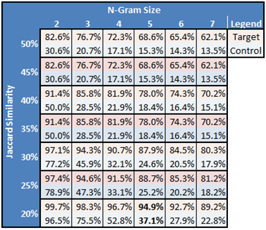
  
<em>The percentages reflect the proportion of the corpora that were flagged as duplicate. The optimal configuration, with an n-gram size of 5 and 20% Jaccard similarity threshold, flagged nearly 100% of instances in the target corpus while showing more restraint with the control group.</em>

  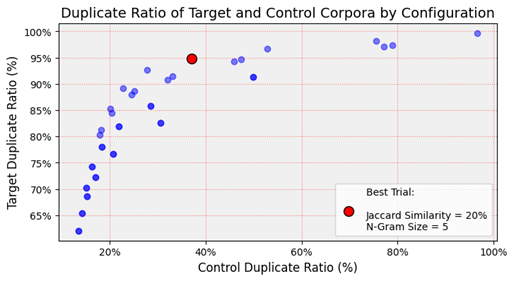
  
<em>This configuration struck a favorable balance between thorough deduplication of the target corpus and minimal impact on the control group. It performed better than the next three configurations, which resulted in a higher loss of control data.</em>

 
 
## Execution of the Deduplication Procedure

While Min-Hashes significantly reduce overhead, the procedure remained extremely expensive, particularly the memory cost. Deduplicating the entire corpus at once would require hundreds of gigabytes of RAM. The fit within hardware constraints, the corpus was randomly batched into eight sub-corpora. To provide the opportunity for a comprehensive pair-wise comparison, that procedure was repeated equal times to the number of batches. Therefore, batching increases the time complexity linearly. Sixty-four iterations of batch deduplication, each taking about two hours, amounted to approximately 128 hours of dedicated computing time. The procedure concluded with 32 million tweets identified as duplicate, representing 53% of the corpus

## Impact of Deduplication on User Balance

It was assumed that high-activity users that contributed hundreds or thousands of tweets to the Twitter corpus would be more likely to produce duplicate text. If this were true, then deduplication should have a natural balancing effect on user contributions. Following deduplication, the relationship between the size of user contributions and the likelihood of duplicate text was analyzed. This involved segmenting the corpus by user contributions and calculating the duplicate ratio. 

  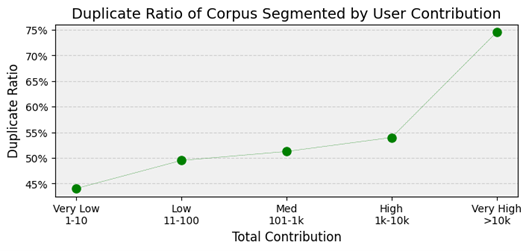
  
<em>Within the normal range, there was no relationship between contribution size and duplicate ratio. Deduplication reduced the corpus volume by approximately half across contribution levels. However, the 3% of the corpus contributed by ‘Very High’ activity users was reduced by 75%. Therefore, those users with outlying zone of ‘Very High’ activity do seem to be more likely to produce repetitive text. These users are examined more closely in the analysis that follows.</em>

  
  
<em>Most of the ‘Very High’ activity users produced more than 80% duplicate tweets. Therefore, the deduplication procedure did have a limited balancing effect on user contributions. However, a few of these outlier uses returned duplicate ratios that were well below average.</em>

Deduplication partly balanced the corpus by reducing the influence of outlier users, yet it remains biased towards heavy contributors. The tables that follow provide text samples from three 'Very High' contributors, illustrating varying impacts of deduplication and supporting its effectiveness in targeting redundant texts.

  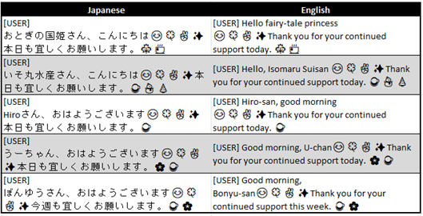
  
<em>This user, with a 99% duplicate ratio, generated 31k tweets at a rate of 112 tweets per day, showing minimal language variation. The content predominantly consists of template text using a slot fill mechanism to incorporate names.</em>

  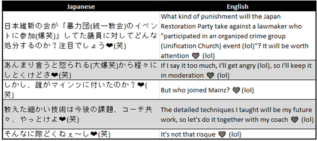
  
<em>This is the Twitter corpus' largest contributor, and they had a 57% duplicate ratio. They posted 45k tweets at a rate of 173 tweets per day, usually ending posts with "❤️(笑)". They employ unconventional posting styles, such as 'daisy-chaining' to bypass character limits. Chains are disrupted during preprocessing. Within a model’s capabilities, these tweets are difficult to interpret because they lack context. Nevertheless, this user makes a valuable contribution by discussing a variety of topics.</em>

  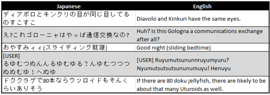
  
<em>This user, posting 12k tweets at 45 tweets per day, shows no signs of automated text generation. Their contributions are linguistically varied, enhancing the corpus diversity.</em>

## Corpus Refinement by Capping User Contributions

The review of user samples indicated that deduplication achieved its intended purpose, but a comprehensive examination was not feasible. This leaves some uncertainty about potential biases introduced by user imbalance. To advance the refinement process, a simple heuristic was implemented: contributions from individual users were capped at one hundred tweets. 

  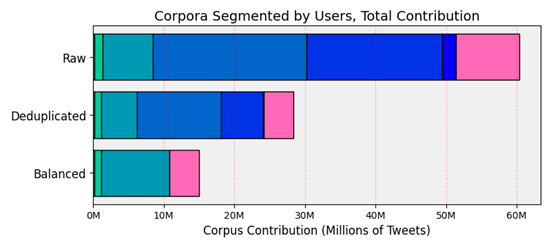

  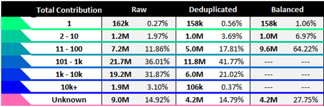
  
<em>This analysis illustrates the change in user balance over stages of refinement. The relative contributions from users of ten or less tweets significantly increase. From users of more than 1,000, contribution decreases. Almost two thirds of the balanced corpus was from the highest contributors. Therefore, the balanced corpus remains skewed, but it has better representation of lower level contributors.</em>

Deduplication cut the corpus size from 60 million to 27 million tweets. User balancing reduced it to 15 million tweets, much smaller than sizes reported in other studies (Barbieri et al., 2022; Cieliebak et al., 2017; Nguyen et al., 2020; Sakaki et al., 2019). Despite its smaller size, the refined corpus allows for more efficient training and is expected to provide a more diverse representation of language. This setup should help ensure that the model can learn effectively from a broad spectrum of content without being dominated by prolific users. To further investigate the impact of refinement on diversity, the corpora were compared by n-grams, mentions, and hashtags.

## Content Analysis of Raw and Refined Corpora

Comparison of the Raw and Deduplicated corpora indicates that deduplication maintained a high level of linguistic diversity. Despite being less than half the size, the Deduplicated corpus retains approximately 75% of the unique n-grams from the Raw corpus.  Conversely, the unique n-grams drop significantly from the Deduplicated to the Balanced corpus.

  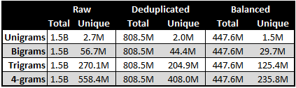
  
<em>MeCab was used to tokenize the corpora (Kudo et al., 2004). Analysis of n-grams was facilitated by the Python library, NLTK.</em>

The ratio of unique to total n-grams is the highest in the Balanced corpus. However, this is not a fair comparison, as the ratio of unique to total n-grams naturally decreases as corpora increase in size. To estimate content diversity as a function of text quality rather than corpus size, a million tweets were sampled from each corpus.  The following plots analyze the diversity of n-grams, hashtags, and mentioned users. These analyses calculate diversity using the Shannon Diversity Index. If the refinement processes enhanced the diversity, then these three elements should increase across stages of refinement.

  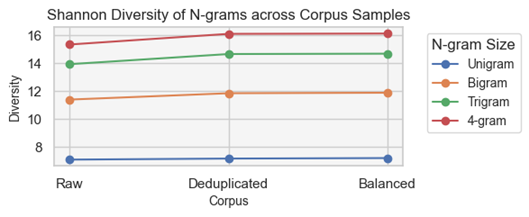
  
<em>This analysis shows that diversity of n-grams increases slightly from the Raw to the Deduplicated corpus. However, there is no change between the Deduplicated and Balanced corpora.</em>

  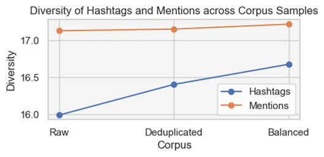
  
<em>The mentioned users remain consistent, but hashtag diversity increases at every level of refinement. Hashtags are related to the topical content of corpora (Petrović et al., 2010). The increase in hashtag diversity may be a positive signal for the balance of content within the Balanced corpus.</em>

Based on these analyses, the assumption that linguistic diversity would with refinement was partially supported. The transition from the Raw to the Deduplicated corpus showed a slight increase in n-gram diversity, which supports that the examples that remain are less repetitive. Further refinement through balancing did not enhance n-gram diversity. However, it did improve hashtag diversity, suggesting more rounded topical coverage within the Balanced corpus. These findings are promising. However, the difference in diversity measurements is small, and the magnitude is not well understood. This study would be better informed by a more comprehensive analysis. It should take multiple samples to confirm the reliability and significance of measurements. Comparing these findings with another Twitter corpus would help frame the conclusions within the bigger picture of Twitter space.

The final phase of content analysis focuses on the most common n-grams, hashtags, and mentioned users. The objective is to identify problematic terms from the Raw corpus. This includes n-grams typically found in template-generated texts, promotional or spam-related hashtags, and users often mentioned in automated posts. If corpus refinement was successful, then these elements should be significantly reduced in the refined corpora.

  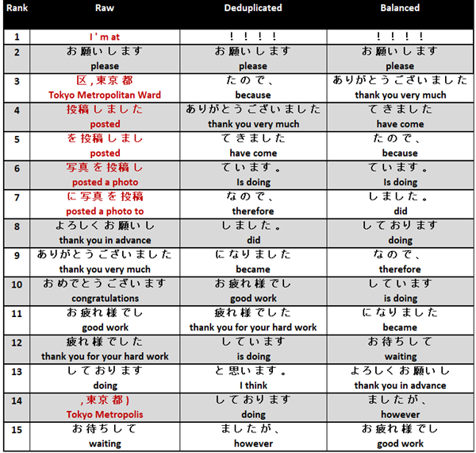
  
<em>Because of the prevalence of Swarm tweets, ‘I’m at’ is the top ranking 4-grams. The problematic entries highlighted in red dropout and are appropriately replaced with phatic language, such as “お 願い し ます”, and grammatical phrases, such as ”し まし た 。”.</em>

  
  
<em>The top frequency hashtags do not change as dramatically as the other categories. “#17LIVE” is a streaming website that advertises on Twitter aggressively. The other two hashtags are engagement seeking. The most frequent type of tag are place names, which likely resulted from the sampling method.</em>

  
  
<em>Japanese transportation entities, such as JR East, utilize Twitter for public outreach. Three of these entities rank among the most mentioned users, and their tweets tend to be highly repetitive. The other problematic accounts are tied to businesses. After refinement, the most frequently mentioned users shifted to include news sources like "@YahooNewsTopics," politicians such as "@Kishida230," and lesser-known individuals like "@souhakurumi" who are primarily recognized through their Twitter presence.</em>

The final analysis of content showed that the refinement process impacted the representation of the corpus. Repetitive n-grams, spammy hashtags, and corporate users are signals of bloated content. Following deduplication, these features dropped in salience. It was expected that the Balanced and Deduplicated corpora would yield different results, and their similarity raises doubts about the effectiveness of the balancing step. While there is hope that the Balanced corpus will enhance training efficiency, the analysis indicates that balancing users did not improve the diversity of the corpus.

