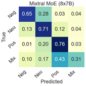

# Building the Sentiment Dataset

This chapter describes the process of building the Japanese Twitter Sentiment 1k (JTS1k) training set. It begins by defining key measures of dataset quality: size, balance, representativeness, and reliability. Preparing for the annotation phase was a team effort involving two native Japanese speakers. A balanced and representative dataset was selected from the Twitter corpus for annotation. The annotation procedure was rehearsed, and clear task instructions were developed. As annotations proceeded, reliability was validated by measuring annotator agreement. Once annotation was complete, JTS1k was used to benchmark a series of generative AI models, demonstrating its compatibility with a variety of models.

## Considerations for Size

Effective model training requires a diverse and representative language sample. Traditionally, representation has been achieved through large volumes of data, as larger datasets tend to yield better results. However, any dataset will fail if annotation quality is poor. Building high-quality datasets is costly and requires a budget that supports validating reliability proportional to the dataset size. Cielieback et al. (2017) optimized size and reliability in constructing a sentiment analysis dataset of 10,000 German Twitter examples (SB10k). With stricter annotator agreement thresholds, it outperformed a less reliable dataset ten times its size. In the pre-transformer era, they posited that 10,000 examples were the minimum for high-quality outcomes. Contemporary encoder models achieve state-of-the-art results with significantly smaller datasets (Devlin et al., 2019). Advanced generative AI models also perform well in some tasks with minimal examples (Brown et al., 2020). Given these advancements and budget constraints, a dataset of a thousand examples was deemed sufficient, expected to perform adequately on its own and be useful in future, larger-scale projects.

## Considerations for Balance and Representativeness

The optimal composition of a dataset depends on the task requirements. For detecting sentiments in general contexts where clear opinions are rare, a higher proportion of neutral examples may be preferable. However, the target sentiment analysis model is intended for an opinion-rich data stream, often containing subtle expressions of sentiment. Therefore, an evenly balanced dataset is more appropriate.

The methodology required an equal and representative sample from each of the four sentiment categories: positive, negative, neutral, and mixed. Given the smaller size of the dataset, achieving representativeness required deliberate sampling techniques. For instance, Cielback et al. (2017) enhanced token representation by applying k-means clustering to bag-of-words representations of their corpus. For clustering the Japanese Twitter corpus, a more contemporary approach was used. K-means clustering was applied to sentence embeddings encoded by a prototype BERT for Japanese Twitter . While the bag-of-words methodology promotes unigram diversity, this method is more semantically driven. Both strategies aim to capture the full diversity of language usage, ensuring that the datasets are representative and comprehensive in their linguistic features.

Following the methodology of Cielback et al. (2017), the Twitter corpus was divided into 250 clusters, with the intention of sampling one example from each sentiment class per cluster. Their publication emphasizes efforts to maximize the inclusion of mixed sentiment candidates. Despite these efforts, their dataset predominantly consisted of neutral tweets, making up over half of the total, while mixed sentiment tweets constituted less than 5%.

## Considerations for Reliability

Reliability in a dataset indicates the probability that annotations accurately reflect true values. Typically, reliability is assessed by labelling examples multiple times and evaluating the consistency among labels. The choice of metric for measuring this agreement varies, depending on how the workload is distributed among annotators. For annotating JTS1k, subsets of data were assigned unevenly among numerous crowdworkers. Therefore, Krippendorff’s alpha was the most appropriate measure. Alpha values range from 0 to 1, where 1 represents perfect agreement. Generally, agreement scores are considered valid above a certain threshold, which varies by task (Hayes & Krippendorff, 2007). In a review of multilingual Twitter sentiment datasets, Mozetič et al. (2016) found that the most reliable datasets achieved inter-annotator agreement scores between 0.6 and 0.7.

The complexity of JTS1k is slightly higher than the datasets reviewed by Mozetič et al. (2016) because it additionally includes the mixed sentiment label. More labels increase the opportunity for disagreement, which threatens the alpha score. Cieliebak et al. (2017) used an even more complex labelling scheme with the addition of the unknown label. Although they targeted high agreement levels, they reported an alpha of 0.39. In this study, an alpha of 0.5 was considered the minimum threshold, with 0.6 indicating good agreement.

## Participatory Design for Dataset Annotation

The annotation phase was a critical and high-risk stage of the experiment, requiring a reliable pool of crowdworkers and an efficient interface for presenting stimuli and recording responses. These requirements were met by CrowdWorks , a Japanese freelance recruitment service. A key advantage of this platform is its interface, which is designed entirely in Japanese, enhancing usability for native speakers. Additionally, CrowdWorks mandates that workers verify their identity using documents issued in Japan, ensuring the recruitment of individuals who are not only fluent in Japanese but also culturally knowledgeable. The web application supports survey creation, worker recruitment, response verification, and the compilation of labelled data into CSV format, streamlining the entire data collection process.

The approach for gathering data from crowdworkers followed the methodology of participatory design (PD) (Sanders & Stappers, 2008)(Sanders & Stappers, 2008). One of the core elements of PD is to identify the primary stakeholders and to clarify the stakes. For building JTS1k, there are two groups:

- **Developers**: This includes any public or private entity that may use the dataset for analyzing sentiment. Training and a model, even one optimized for efficiency, is costly. The dataset is only valuable if its labels are valid, and it is potentially harmful if not.
- **Social Media Users**: These individuals provide the data for analysis, with primary concerns centered around privacy, consent, and ethical data use. For users whose tweets were selected for JTS1k, the stakes are higher due to privacy concerns. Identifiable information was properly anonymized throughout the process.

Two native Japanese speakers were recruited to help prepare the dataset for annotation. In the context of a group design process, PD advises defining roles and clarifying how team members align with the primary stakeholders. The team members are stakeholders too, and it is important to establish how they benefit from the completion of the project. The roles were defined as follows:

- **Author**: The project leader who provides direction and incorporates feedback from the team members.
- **Quality Control (QC) Specialist**: Ensures a balanced selection of clear examples for crowdworkers. Tweets were pre-labelled by both the Author and the QC Specialist, and only those with mutual agreement moved to the annotation phase. The QC Specialist, who is close to the author, knowledgeable of the research aims, and generally trustworthy, is motivated to see the project succeed.
- **Expert Annotator**: Reviews prototype datasets and provides feedback to refine the procedure. This process was repeated until both the Author and the Expert Annotator were satisfied that the task and sentiment labels were clearly defined. During the annotation phase, the Expert Annotator also participated as a crowdworker. The Expert Annotator is a web developer that meets with the Author regularly for language exchange, and they are motivated to see the project succeed.
- **Crowdworkers**: Paid 300円 to label batches of 29 tweets. This group is particularly vulnerable because, at the Author’s discretion, responses may be rejected. In this situation, renumeration is not issued, and their rating suffers, which may impact their access to future work.

Every member of the dataset annotation team represented the interests of the developers by ensuring the creation of a useful dataset. The QC Specialist and the Expert Annotator protected the interests of the crowdworkers by participating in selecting examples and writing instructions. The crowdworkers are an important group of stakeholders because they have no vested interest in the creation of JTS1k. Therefore, they are the least biased and the most representative of social media users. Incorporating the feedback of the native Japanese team members ensured the dataset annotation was a mutually beneficial experience.

## Workload Distribution and Monitoring of Annotation

The dataset was divided into forty batches. Each workday, three or four batches were published, and crowdworkers usually completed several batches. Batches published in the same workday included four repeated examples for measuring self-agreement. These examples were changed each workday to ensure a varied set of responses for measuring self-agreement. Inter-annotator agreement was monitored throughout the process and consistently maintained a comfortable margin above the set acceptability threshold. Fewer than 10% of the responses were rejected, and annotations were always returned on the day of submission. The JTS1k training set was complete within a budget of €220. The PD approach guided the development of a balanced and reliable dataset, which is supported by the analysis that follows.

## Evaluating Size, Balance, and Reliability

The annotation of JTS1k mostly met the original criteria of size, balance, and reliability. A small portion of data was lost due to a failure to reach consensus, resulting in a 7.5% shortfall of the size target. While the dataset was balanced for most labels, the mixed category was underrepresented, consistent with difficulties noted by Cieliebak et al. (2017). The inter-annotator agreement measured 0.56, increasing to 0.63 when tie votes were excluded, which is well above the acceptability threshold. Additionally, the self agreement was nearly perfect, alleviating concerns about crowdworker burnout. Inter-annotator and self agreement scores were more than satisfactory, supporting that the annotations were completed diligently and in good faith.

  
  
<em>The annotations were consolidated by majority vote. 75 examples were excluded because they did not reach a majority. The dataset is mostly well-balanced, with an approximate label ratio of 1: 1: 1: 0.5. </em>

  
  
<em>The inter-annotator agreement scored an alpha of 0.57. The agreement of individual labels was calculated by treating the problem as binary. The self-agreement was nearly perfect at 96%, given by repeating over 10% of the total annotations. </em>

 

The alpha scores for individual labels showed varying degrees of disagreement. The positive label was the most straightforward, with an alpha of 0.67. In contrast, the mixed class produced the most disagreement, resulting in a low score of 0.43. The high level of disagreement around the mixed class, along with difficulties in achieving balanced representation, marked the mixed category as the most challenging label. Figure 6.1 explores inter-label disagreement further with confusion matrices that compare annotations with majority vote labels.

  
  
  
<em>Comparing the annotations with their majority vote labels provides a clearer picture of the patterns of confusion exhibited by the annotators. </em>

 
   

The most confusion arises between the negative and neutral sentiments. This may be connected to the Japanese convention of expressing negative opinions discreetly. The concept of “腹芸” (hara gei), which translates to “belly art,” refers to the practice of communicating from one’s gut.

  
  
<em>This tweet, critiquing Noda’s party, conveys negative sentiment subtly rather than explicitly. </em>

 

 
The confusion between negative and neutral sentiments is not restricted to Japanese. The tendency for people to politely express negative opinions through factual statements is a recognized challenge in sentiment analysis (Liu, 2012). In contrast, negative and positive labels show the least amount of pairwise disagreement, and mixed was confused with all other categories.

The next round of analysis uses the complete JTS1k to benchmark a series of generative AI (GenAI) models. State-of-the-art GenAI models are highly effective at zero-shot sentiment analysis across datasets (Krugmann & Hartmann, 2024). If they perform well with JTS1k, that will support the notion that JTS1k aligns well with other sentiment analysis datasets. This investigation will also examine the response patterns of GenAI to see if they exhibit the same patterns of confusion as human annotators or if they show their own unique biases.

## Benchmarking Generative AI Models for Sentiment Classification

  
  
<em>Three groups of GenAI models were evaluated. The Meta Llama models offer insights into how performance is influenced by the number of parameters and enhancements in training data and architecture. The Japanese Llama modes evaluate the benefits of language adaptation. The models by MistralAI, Google, and OpenAI represent state-of-the-art.</em>

 

GenAI models are advantageous over encoder models due to their adaptability to various tasks through prompt engineering. They require minimal training examples, with the most advanced models achieving high performance in zero-shot testing (Krugmann & Hartmann, 2024; Radford et al., 2019). Prompt engineering is like giving instructions to crowdworkers: tasks must be clear, examples provided, and expected responses modeled (Giray, 2023). Some models, especially during training, struggled to produce understandable responses. The top-performing models handled natural language instructions well. For example, when ChatGPT was directed to output JSON while using CrowdWorks instructions, it generated precise and well-structured responses. In contrast, smaller models often returned responses that were fragmented, overly detailed, or formed incorrectly. These models showed improvement when given detailed examples of the input-output cycle. Using explicit examples to impose structure was effective across all models but it used more tokens than necessary. For advanced models that do not require detailed instructions, this approach is inefficient. All models were tested with the same prompt setup in this study, which worked well here but is generally costly and not advisable for more sophisticated models.

The GenAI models' performance was assessed based on their ability to classify the JTS1k dataset with few-shot learning. Newer, larger models were expected to perform better. The Japanese Llamas were anticipated to surpass the original. Among top-tier models, OpenAI was expected to lead.

  
  
<em>Adding more parameters generally improves model performance, albeit with diminishing returns. The Llama 3 models marked a significant upgrade over their predecessors. The smallest Llama 3 nearly matched the performance of the mid-sized Llama 2, whereas the smallest Llama 2 performed only slightly better than random guessing. The largest Llama 3 surpassed its counterpart by 10%.</em>

 

  
  
<em>Independent developers, noting suboptimal performance on Japanese tasks, fine-tuned the smallest Llama 3 using a Japanese training corpus. Their efforts led to performance enhancements, with the top Japanese-tuned Llama nearly reaching the F1 score of the standard Llama 3 (70B).</em>

 

  
  
<em>MistralAI demonstrates promise in the Mixture of Experts (MoE) architecture with Mixtral. Despite having fewer parameters, it outperforms Llama 3. GPT 3.5 matched the performance of Google Gemini. GPT 4 set a high benchmark that would be difficult to compete with.</em>

  

Further analysis focuses on the specific responses provided by GenAI models. The crowdworkers that annotated JTS1k exhibited three response patterns: confusion between negative and neutral classes, clear distinction between negative and positive classes, and challenges classifying mixed classes. Examination of GenAI model responses show whether they exhibit similar patterns. Two alternative patterns of bias emerged: the ‘Optimistic’ models and the ‘Polarized’ models.

  
  
  
  
<em>Likely influenced by a directive to please users, the ‘Optimistic’ models are hesitant to select the negative category and readily choose positive (Buscemi & Proverbio, 2024). This pattern is most prevalent in the smallest Llama 2, which also had the lowest F1 score. The smallest Llama 3 shows significant improvement. Its negative classifications are highly precise, but low in recall. The Mistral model avoided both the negative and the mixed categories.</em>

 

  
  
  
  
<em>The ‘Polarized’ models made accurate predictions about the three main sentiment categories but rejected the mixed class. These included all the Japanese Llamas, which is an interesting development given that the original Llama 3 was overzealous with the mixed category.</em>

  
  
  

  
  
  
  
<em>These models are the most consistent with human responses. There is confusion between neutral and negative, distinction between negative and positive, and mixed is a consistent challenge. Showcasing its superiority, GPT-4 classifies all categories with human-like performance.</em>

 
          

Most GenAI models showed biases that did not match human behaviour, pointing to the complex challenge of designing AI to be safe, compliant, and accurate. The models often struggled with the mixed category, a challenge that human annotators managed more effectively. Notably, GPT4 classified mixed examples with high precision and recall. This suggests that as models grow and sophistication, they can make deeper inferences that better align with human judgment.

## Cross-Lingual Transfer

The final evaluation of JTS1k focuses on cross-lingual transfer, which tests a model's ability to generalize across languages (Conneau et al., 2020). The study uses the Twitter Sentiment Multilingual (TSML) dataset, containing 24,000 evenly balanced examples across eight languages (Barbieri et al., 2020). The labels are negative, neutral, and positive. XLM-T is considered highly capable of cross-lingual transfer and has shown competence with various cross-lingual training and testing configurations using TSML. This study aims to demonstrate JTS1k's robustness as a training set by examining its compatibility with XLM-T and TSML. The experiment compares three datasets:

- **JTS1k** is the target dataset, reduced to just under 800 examples to match TSML's labelling scheme of negative, neutral, and positive.
- **WRIME** is a Japanese emotion and sentiment analysis dataset representing social media (Suzuki et al., 2022). It uses continuous polarity scores converted to categorical labels as described in Chapter 9 and contains over 30,000 examples.
- **SB10K** is a German Twitter sentiment analysis dataset from the pre-transformer era (Cieliebak et al., 2017). It includes 10,000 examples but is less balanced and has inconsistent annotations.

This experiment fine-tunes the base and large versions of XLM-T on each dataset. The models are compared with the state-of-the-art XLM-T sentiment model that was fine-tuned on all languages from the TSML dataset. JTS1k will be considered successful if it demonstrates compatibility with the other datasets. 

  

  
  
<em>Compares the performance of fine-tuned XLM-T on the test splits of experimental datasets and the language splits of TSML. Peak scores are highlighted in bold.</em>

 

Within the test splits of the three datasets, the top scores were achieved by the large models with matching training data. All models evaluated extremely well with JTS1k, with WRIME showing the strongest transfer. The XLM-T sentiment model performed significantly better on JTS1k than the other two datasets. The models fine-tuned on JTS1k transferred well to WRIME but were the lowest performers on SB10k. WRIME models tested better than JTS1k models, but XLM-T sentiment showed the best transfer. The SB10k models performed decently on the two Japanese sets but were the lowest performers overall.

Within the language splits of TSML, XLM-T sentiment is the best performer in almost every language. The SB10k models are dominant in their native language, German. Interestingly, the large JTS1k model achieved the top score in Arabic, an unexpected and difficult-to-interpret result. When comparing the large models, the JTS1k model earned the best results, scoring closely to the XLM-T sentiment on nearly every language split. Although it struggled with French, it scored higher than the others. Comparing the base models, WRIME appears to be a better overall fit. Despite underperforming in a few languages, it tops JTS1k in most languages. Outside of German, SB10k underperformed in all categories.

