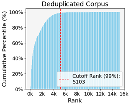
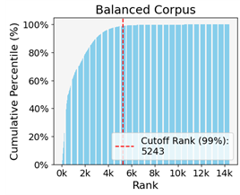
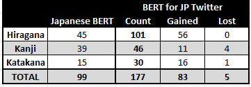

# Designing the Tokenizer

This chapter explores the design of the tokenizer for the BERT models tailored for Japanese Twitter. The tokenizer is based on the configuration from Japanese BERT and incorporates a specially adapted vocabulary. The chapter begins with an overview of the Japanese writing system, focusing on the various character families used. It then discusses various web elements and how they affect preprocessing and tokenizer design. WordPiece tokenizers are trained using a specially prepared corpus. This study compares two corpora representing different levels of refinement, and both were used to train a unique vocabulary. The refined corpora are compared with an analysis of token frequency. The vocabulary of the original and Twitter tokenizers is compared, considering both character families and parts of speech. The Twitter tokenizers have adopted colloquialisms, neologisms, and multilingual expressions, better aligning them with the Twitter domain.

## Overview of Japanese Writing

Japanese uses four character sets: hiragana, katakana, kanji, and romaji. Hiragana, the indigenous Japanese syllabary, consists of 46 symbols. It is the primary script for grammatical functions, such as verb inflections and conjunctive particles. This flexible character family is also used for names, phatic expressions, and native Japanese words that lack kanji representations. Katakana, a parallel syllabary, primarily represents foreign words. Along with hiragana, it is commonly used for interjections and onomatopoeia. Kanji, the largest character set, consists of logographic characters mainly derived from Chinese. There are tens of thousands of kanji, but only a fraction is routinely used. Romaji, Japanese use of Roman letters, is most frequently used with named entities, like place names and international brands. It is also commonly used when culturally appropriate, such as in expressing basic English words and phrases or in reference to pop culture. These character sets are somewhat interchangeable, and flouting convention might communicate some pragmatic intent. Nevertheless, appropriate character use is critical to the coherence of Japanese writing.

## Considerations for Preprocessing

Converting raw text into machine-readable inputs is a longstanding challenge in NLP. Modern algorithms, such as WordPiece and SentencePiece, are highly effective, but the field continues to evolve (Devlin et al., 2019; Godey, et al., 2022;  Kudo et al., 2018). Twitter data presents specific challenges for preprocessing. For example, tweets often contain web elements, like URLs, which should not be tokenized like regular text because they introduce noise that models struggle to handle. Additionally, preserving the text's structure is important, and the informal and fragmented nature of tweets can complicate tokenization. Designing a vocabulary for Twitter data must address these issues to ensure accurate and meaningful text analysis.

### Special Tokens for Mentioned Users and URLs

Twitter commonly features three web elements: URLs, mentioned users, and hashtags. The State-of-the-art models, XLM-T and BERTweet, employ different strategies for handling web elements (Barbieri et al., 2022; Nguyen et al., 2020). To accommodate mentioned users, both models mitigate noise through substitution with a normalized token. XLM-T uses the same strategy for URLs. On the other hand, BERTweet filtered tweets containing URLs from their training corpus as a precaution against spam, and their documentation recommends removing URLs during preprocessing. Hashtags, which often carry meaningful context, are left unmodified during preprocessing by both models.
The vocabulary design follows the approach of Barbieri et al. (2022) by substituting both URLs and mentioned users with normalized tokens. As an additional precaution, they were assigned special token status. Special tokens are normally reserved for specific functions, but they have the advantage of never being combined with other tokens. This strategy helps preserve the structural integrity of the tweets while minimizing the noise introduced by URLs and mentioned users.

### Special Tokens for Newlines

Models also differ in their handling of structural tokens, like newlines. In the context of a long document, newline characters are cleaned out during preprocessing because they are not meaningful. However, in the context of short tweets, newlines can be important structural elements. XLM-T, which inherited its tokenizer from XLM-R (Conneau et al., 2020), treats newlines as general whitespace tokens. In contrast, BERTweet assigns newlines their own token status. WordPiece tokenizers are generally configured to remove newlines during preprocessing, but the HuggingFace tokenizer can be easily adjusted to treat newlines as normal tokens. This study followed Nguyen et al. (2020) by assigning newlines a unique token. This approach helps preserve the structural integrity of tweets, ensuring that important formatting cues are not lost during preprocessing.

## Preparing the Tokenizer Training Corpora

The WordPieceTrainer  in the Transformers library generates a vocabulary from a training corpus, aiming to minimize sequence lengths and optimize coverage (Wolf et al., 2020). This tool is designed for use with space-segmented languages. For Japanese, which does not segment words with spaces, preparing the training corpus involved some additional considerations. The BertJapaneseTokenizer streamlines preprocessing by normalizing raw text and pre-tokenizing it with MeCab.  To prepare the training corpora for the WordPieceTrainer, the refined Twitter corpora were pre-tokenized by the same mechanism.

The WordPieceTrainer prioritizes individual characters in its vocabulary. This approach poses a problem with Twitter data, which contains a wide variety of characters, many of which appear only once or a few times. For instance, the Deduplicated Twitter corpus contains over 16,000 unique characters. To optimize character selection, corpus analysis is necessary. In this study, characters were ranked by the number of tweets in which they appeared. Histograms were generated to identify the minimum number of characters required to cover 99% of the corpus. The results from both corpora are plotted in Figure 7.1, providing a clear visualization of the cutoff point for effective vocabulary coverage.

  
   
  
<em>Different training corpora yield different vocabularies. The larger Deduplicated corpus is covered with 5,103 unique characters, compared to 5,233 for the Balanced corpus.</em>

 

Another important consideration is the inclusion of essential characters, especially in Japanese, which uses abundant kanji. The original Japanese BERT includes over 6,000 kanji, many of which may not be frequently used in Twitter. Japanese Twitter tends to use more hiragana and katakana compared to more formal texts. However, it is important to include certain kanji that are essential for general understanding, even if they are underrepresented in the Twitter corpus. To ensure these essential kanji are covered, the WordPieceTrainer was initialized with the jōyō kanji , a standardized set of commonly used characters in Japanese.

The WordPieceTrainer, when provided with a training corpus, a vocabulary size, a character limit, and a list of essential characters, generates an optimized vocabulary. To evaluate the vocabulary, the Twitter corpora were tokenized using the original Japanese BERT tokenizer and the two tokenizers yielded by the refined corpora. The analysis searches for signs of improvement, including shorter sequence lengths, a reduction in the frequency of unknown tokens, and a better representation of low-frequency tokens.

## Analysis of Token Frequency

  
  
<em>The original Japanese BERT vocabulary was well optimized for general text. When tokenizing the Twitter corpus, it utilized over 95% of its vocabulary, demonstrating its efficiency in covering standard Japanese language use. However, it struggled with the abundance of non-standard characters found on Twitter, resulting in nearly 3% of tokens being returned as unknown. In contrast, the Twitter-specific tokenizers returned only 0.05% unknown tokens, showing a significant improvement in handling the diverse and informal nature of Twitter text.</em>

 
 

The average sequence lengths dropped by almost 10% when using the Twitter tokenizers compared to the original Japanese BERT. Shorter sequences are more efficient to train, and even small differences can have a significant impact over the long pre-training process. Furthermore, the original BERT had less frequent low-frequency tokens. Around the midpoint of the vocabulary by rank frequency, the number of tokens in the original BERT drops below that of the Balanced corpus, despite the count being from the Deduplicated corpus, which is twice the size. Comparing the two Twitter tokenizers, the token distribution is quite similar. The Balanced tokenizer counts about half as many tokens as the Deduplicated tokenizer, reflecting the differences in corpus size and content.

## Change in Vocabulary after Twitter Adaptation

This section examines the differences in vocabulary between the original Japanese BERT tokenizer and the two tokenizers derived from the refined Twitter corpora. The expectation is that the new vocabulary will include terms characteristic of Twitter usage, such as colloquialisms, neologisms, and multilingual expressions. Conversely, the vocabulary is expected to exclude domain-specific terms like archaic words, historical figures, and mathematical and scientific terms. This analysis begins by exploring the changes in character representation.

  
  
<em>The vocabularies of the three tokenizers were classified by their character family. The Special tokens have additional functions. The Twitter model added three Special tokens: [URL], [USER], and ‘\n’ (newline). The Script characters are from languages outside of the target. They usually appear in the context of kaomoji (Bedrick et al., 2012). The Pictographs mostly consists of emoji, but also encompasses decorative elements like dingbats.</em>

 

The change in vocabulary represents a significant shift in training material. The number of kanji terms was reduced by about 25%, while hiragana terms more than doubled. This is consistent with the Twitter domain, where hiragana is used more frequently than kanji. Surprisingly, the number of katakana terms remained equivalent. Although katakana is nearly as productive as hiragana, this suggests that many katakana terms were lost during the Twitter adaptation. Pictographs, which were scarcely represented in the original vocabulary, have now become the fifth largest category. The two Twitter tokenizers differ by only 1,200 terms. There are some significant differences in the composition of the vocabulary, particularly in the kanji, romaji, and script. However, these differences are difficult to interpret. At this level of analysis, the two Twitter tokenizers can be considered roughly equivalent and distinct from the original.

The analysis continued by classifying the vocabulary based on parts of speech. The method used for classification considers how the part of speech for certain terms changes in different contexts. MeCab, which combines tokenization with part of speech tagging, was used to tokenize and tag the Deduplicated corpus. Every token in the vocabulary was classified with a frequency distribution across the different parts of speech, reflecting their observed usage in the Twitter corpus. This methodology provided a context-aware analysis that accurately represented Twitter.

  
  
<em>The POS column represents the original tag as given by MeCab. This analysis did not consider subword tokens. The frequencies represent the number of terms that were tagged in at least 10% of contexts. Consequently, many terms were counted across several parts of speech.</em>

 

The analysis that follows focuses on parts of speech grouped by class. From the vocabulary gained, the analysis searches for examples of neologisms, colloquialisms, and multilingual expressions. It also looks for common themes among the items lost. Examples of terms with loaded sentiment are provided. For simplicity, this analysis groups the vocabularies from the Twitter tokenizers together.

### Nouns

  
  
<em>The largest change in vocabulary was observed among nouns, making this category challenging to characterize comprehensively.</em>

 

Many terms were gained across different character families. A significant number of terms were lost in kanji, katakana, and romaji, reflecting their use in more formal domains. However, hiragana terms were maintained, supporting their representation in casual contexts. New colloquialisms include expressions like すまほ (sumaho) for smartphone and パソコン (pasokon) for personal computer. Notable neologisms such as リモートワーク (remote work) and ワンオペ (one operation) reflect changing social and work dynamics. Katakana is the main character family for multilingual expressions, like カフェ (cafe) and アルバイト (part-time job) from the German "Arbeit."

 

  
  
<em>The term びっくり (surprised) expresses emotional intensity and can convey either positive or negative sentiment. In this context, the user is expressing satisfaction with their living situation.</em>

 

From the vocabulary lost, many terms are related to historical events or figures, such as レオナルド (Leonardo) and スターリン (Stalin). Others are historical terms like 治世 (reign) and 封建 (feudal). Domain-specific terms used in science, mathematics, or specialized industries, such as アルゴリズム (algorithm), 分子 (molecule), 製鋼 (steelmaking), and 技師 (engineer), were also removed. Additionally, rare or less commonly used terms, including obscure kanji like 罕 and 靨, geographic names such as ルイジアナ (Louisiana), and obsolete terms like 𥝱 and 侖, were excluded.

### Verbs

  
  
<em>This category loses a significant number of kanji. For hiragana and katakana, terms double without significant loss from the original vocabularies.</em>

 

 
 
New terms include colloquialisms like やめる (to stop/quit) and つぶやく (to mutter/tweet) are frequently used in casual conversation. Examples of dialectal variation are おる (to be) and いける (to be good at), which are typical expressions of a Kansai speaker. New neologisms include ググる (to Google), which has achieved verb status like English. An interesting multilingual expression is サボる (to slack off), derived from the French "sabotage." Others are ダンスする (to dance) and メールする (to email), which combine katakana phonetizations of the English pronunciation with the auxiliary verb する. Verbs loaded with sentiment include たのむ (to request) and がんばる (to do one's best), which carry positive connotations of trust and determination, while あきらめる (to give up) and さけぶ (to shout) convey negative feelings of defeat and distress.

Many verbs lost are more formal or literary, such as 遂げ (accomplish) and 治め (govern). Some refer to very specific actions, like 乗り出し (embark) and 催さ (host), which are typically used in formal invitations and public addresses. Specialized and technical terms, like 採る (adopt) and 施す (implement), are more suited to professional contexts. Additionally, some verbs are archaic or less commonly used, like 經 (pass through) and 患う (suffer).

  
  
<em>The term つまら is a stative verb that best translates to the adjective, boring.</em>

 

### Descriptive Terms

  
  
<em>This descriptive category GenAIns a significant number of kanji, hiragana, and katakana. Notably, Hiragana terms more than double. Fewer terms, mostly kanji, were lost.</em>

 
 

Japanese is recognized for its rich vocabulary of onomatopoeia. New vocabulary items include literal examples like ゴロゴロ (goro-goro) and ザーザー (zaa-zaa), which express the sounds of rolling thunder and heavy rain. Figurative examples such as ほっ (hotto) and ふわっ (fuwa) convey feelings of relief and softness. Colloquialisms like ヤバい (yabai), which can denote something extremely good or bad, and めちゃ (mecha), an informal intensifier like "very," are commonly used. Neologisms like ウケる (ukeru), meaning "that's funny," and リア充 (ria-juu), referring to someone content with their offline life, have also become part of the modern lexicon.

Many of the terms lost are formal or literary, such as 顕著 (remarkable), 厳格 (strict), and 迅速 (rapid). Some words are rare or complex, like 茫 (vague), 黯 (dark), and 纔 (just barely). Compound or derived forms like 細長い (slender) and 目立つ (conspicuous) are often more context specific. Some words are archaic or less commonly used, like 乘 (ride) and 猝 (sudden). Certain words denote highly specific descriptions, such as 凶暴 (ferocious) and 甚大 (immense). Specialized and technical terms, such as メタリック (metallic) and コミカル (comical), are more suited to professional contexts.

  
  
<em>The figurative onomatopoeia うるうる describes the feeling of tearing up. Normally used to express sadness, this example conveys a positive and moving experience.</em>

 

### Functional Terms

For the functional items, many new terms were gained and very few lost. The analysis will now only discuss new terms. The interjections and pronouns are particularly interesting and are discussed separately.

  
  
<em>The number of interjections grows significantly, with hiragana terms more than triple.</em>

 

Most interjections are composed with hiragana. Many convey emotional intensity where the intended sentiment depends on context, such as あれー, expressing shock. Others communicate a lack of intensity, such as うーむ, which conveys deep thought. Some of the new interjections are dialectally marked. おおきに (ookini) is a thankful remark from the Kansai dialect. わっしょい (wasshoi), chanted by festival-goers carrying heavy a heavy shrine, encapsulates the communal joy and excitement during traditional celebrations. On Twitter, it may be used to show resilience in a difficult situation. くっそ (kusso) is a rude expression that conveys frustration or annoyance. なんちゃって (nanchatte) is a light-hearted expression that means "just kidding."

  
  
<em>こら is diminutive expression used to demand the attention of the addressee. It is often used by parents when scolding their children.</em>

 

  
  
<em>Most of the original vocabulary of pronouns is retained. The hiragana terms more than double.</em>

 

The second person singular pronoun, テメエ is usually rude and derogatory, although it may be used affectionately between those that are close, in a typical context, it is comparing the addressee to an animal.

Japanese personal pronouns are pragmatically loaded, capable of conveying subtle aspects of the speaker’s attitude and social standing. Pronouns like おれ (ore), わし (washi), and ワタシ (watashi) vary significantly in terms of formality and gender implications, with おれ being casually male-oriented, わし an older, somewhat outdated male pronoun, and ワタシ the neutral standard. Meanwhile, forms like おまえ (omae) reflect either familiarity or disrespect, depending on the context. わたくし (watakushi) as a very formal "I" carries a positive, respectful sentiment, whereas 貴様 (kisama) nowadays has a clearly negative connotation. The new vocabulary also includes basic demonstrative pronouns such as ソコ (soko, there), ソレ (sore, that), and コチラ (kochira, this).

  
  
<em>Most of the original vocabulary of pronouns is retained. The hiragana terms more than double.</em>

 

  
  
<em>Most of the original vocabulary of functional items is retained. Hiragana terms grow significantly.</em>

 

Functional vocabulary is traditionally a closed class, and the new terms are generally more flexible variations of the standard vocabulary. Core auxiliary verbs, such as でしょう, ましょう, だろう, たろう, and やろう, were substituted with shortened forms dropping the terminal う. Commonly used elongated forms are represented as well, like なー, ねー, ねえ, and よー. Dialectal variations include さかい (because) from Kansai, じゃろ (probably) from Hiroshima, and ばってん (but) from Kyushu. Colloquialisms such as っけ (was it?), っす (yup), なんか (something like), and ちゃう (different) are common. Neologisms include でしゅ and でちゅ (baby-talk versions of です) and ちゃえ (a casual form of "to finish doing something"). Shortened forms like カノ (his/her) and コノ (this) reflect the trend towards conciseness.

## Comparison of Tokenizers by Unique Vocabularies

The final analysis examines the vocabularies unique to each tokenizer. The table below segments these unique vocabularies by part of speech. It shows that the main distinction of the Balanced vocabulary is a larger selection of nouns. The Balanced vocabulary contains more technical terms and specialized words (釣行, 馬肉), while the Deduplicated vocabulary is more casual, incorporating modern slang and informal language (ウンコ, ちんこ). The Balanced vocabulary also includes a higher frequency of proper nouns and brand names, indicating a focus on specific entities and products (BAND, Beer, Fuji). This is significant because named entities are considered a sign of business influence. An increased number of named entities implies that balancing users may have increased the representation of business accounts rather than reduced it. On the other hand, the Deduplicated vocabulary emphasizes common, everyday words and colloquial expressions (あの世, こたん, ひじき). Additionally, the Deduplicated corpus features significantly more terms from every other part of speech class. These results suggest that the Deduplicated vocabulary may have more emotive capacity, making it a better fit for sentiment analysis.

  
  
<em>Compares unique items between tokenizer by part of speech. The original Japanese BERT tokenizer is markedly different in most categories. The difference between the two Twitter tokenizers is more subtle. </em>

 

 

