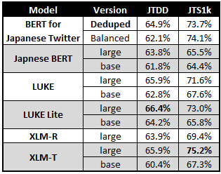

# Pre-Training and Fine-tuning BERT for Japanese Twitter

This chapter describes the hyperparameter tuning, pre-training, and evaluation of BERT for Japanese Twitter. It begins by detailing the setup for adapting BERT to a new domain, including the instantiation of two base models for pre-training, one for each refined corpus. It then discusses the resource-intensive nature of pre-training and the strategies used to manage budget constraints. The training setup was optimized for the available hardware, and a systematic exploration of tunable hyperparameters yielded a targeted search window. Dozens of candidate models were pre-trained within this search window and evaluated by fine-tuning, effectively exploiting both the knowledge gained from exploration and the available computational resources. The best model, continuing as BERT for Japanese Twitter, performed well on both sentiment analysis and defamation detection tasks. This model is evaluated with a series of techniques to assess the semantic networking of the embedding matrix, the quality of masked token predictions, and its competency across Twitter and general domain tasks.

## Considerations for Data Leakage 

Data leakage refers to an undesirable training scenario where models are trained and tested on the same examples. Consistent and well-documented dataset splits are important for preventing data leakage and for comparing different models trained on the same dataset. Strategies for dataset splitting vary at the discretion of the researcher. This study utilized four levels of dataset splits:

- **Train**: This split should be as large as possible while ensuring that the remaining data is sufficient for reliable validation.
- **Validation**: This dataset is used to intermittently provide an unbiased measure of model performance during training. In some setups, it safeguards against overfitting through *early stopping*—a mechanism that halts training when performance on the validation set declines.
- **Development**: This dataset is used to evaluate models after training in a hyperparameter tuning study. It is larger and less exposed than the validation set, thus providing a more accurate, unbiased measure of performance.
- **Test**: After hyperparameter tuning is complete, models are finally compared using the test set. While the development set informed choices during hyperparameter tuning, the test set remained hidden, making it the most unbiased measure of performance.

  
  
<em>Pre-training utilized a much larger data pool, and a higher percentage was dedicated to training. When fine-tuning, the published splits were used whenever possible. Otherwise, they were split by ratios above.</em>

 

## Initiating Models for Domain Adaptation

Pre-training BERT for Japanese Twitter followed the methodology of Barbieri et al. (2022), which continued pre-training XLM-R on a Twitter corpus. However, unlike XLM-T, which inherited the complete vocabulary from XLM-R, the experimental models in this study share only 60% of their vocabulary with Japanese BERT. This distinction is important when initializing the base model. During initialization, common embeddings were migrated, and the remaining ones were randomly initialized. Otherwise, the experimental models began pre-training with the same parameters as the original. Two experimental models were instantiated, each with a unique vocabulary tailored for training on either the deduplicated or balanced corpus.

## Preparing a Training Budget

Pre-training a language model is resource intensive. The subject of this project is a base sized BERT model with 110 million parameters. Pre-training a model of this size calls for days of dedicated processing from a high-end GPU. Compounding the challenge, the success of training depends on the configuration of hyperparameters, referring to the variable elements of preprocessing, model architecture, and learning that influence the training outcome. The relationship between hyperparameters and performance is complex, often requiring multiple full training runs with varying configurations to achieve optimal results.  Each additional hyperparameter exponentially increases the problem’s complexity. This critical procedure must be carefully planned to stay within budget. 

Experienced researchers from Google recently published their perspective on best practices for hyperparameter tuning. They advise starting by defining the compute budget. This project benefited from the high-performance computing cluster (HPCC) operated by the German Research Center for Artificial Intelligence (DFKI). Their support allowed for numerous full training cycles to be run simultaneously without significant queue times. When compute resources are effectively unlimited, Godbole et al. suggest allocating a generous exploratory budget. This exploration phase focuses on understanding the problem through systematic testing of hyperparameter groups, ultimately leading to a narrow search field of variable parameters. To take full advantage of exploration, pipelines were set up for the storage, visualization, and evaluation of data. 

## Exploration of Fixed and Variable Parameters

Exploration began by tailoring the training configuration to the hardware constraints. Two hyperparameters impacting the space complexity of GPU training are the maximum sequence length and the batch size. These represent the maximum tokens per sequence and sequences per training step, respectively. During training, steps are processed simultaneously, requiring the VRAM to accommodate a full batch of maximum-length sequences. Larger batch sizes enhance training speed without affecting the model’s potential performance (You et al., 2020). However, batch size strongly interacts with other hyperparameters, particularly the learning rate. It is advised to optimize the batch size early and treat it as fixed (Godbole et al., 2023). Standard practice involves selecting a sequence length that represents the data and paring it with a batch size that fully utilizes the available VRAM. For instance, in training BERTweet, Nguyen et al. (2020) maximized their batch size by aggressively restricting the sequence length to 64. Given the significant data loss from refinement, this study opted for a more inclusive maximum. Figure 8.1 shows a histogram of the Twitter corpus comparing cumulative percentages of varying tokenized lengths. A maximum sequence length of 116 tokens was chosen, covering 99.9% of the corpus, and the minority of overlength sequences were truncated during preprocessing. Afterwards, the batch sized was calibrated to 55, optimally utilizing the 12GB of VRAM of the lowest spec GPU of the HPCC.

The hyperparameter problem is simplified by aligning fundamental design elements of the training setup with established research. Those hyperparameters that define model architecture were fixed to retain knowledge from the original Japanese BERT. This includes dropout, a layer active only during training that prevents overfitting by interfering with overly complex layers (Srivastava et al., 2014). Although dropout is a common variable parameter, all Japanese encoder models on HuggingFace used the same value (Wolf et al., 2020). Pre-training used a learning rate schedule with a warm-up and linear decay, which is a common choice for long training runs. Likewise, it also uses an AdamW optimizer. Adam is a standard choice for NLP that facilitates quick convergence and superior generalization through adaptive parameter updates (Kingma & Ba, 2017). AdamW, incorporates weight decay, which further supports generalization by penalizing larger weights (Loshchilov & Hutter, 2017).

  
  
<em>A histogram of tokenized tweet lengths was used to select an optimal max sequence length of 116.</em>

 

At this stage of the exploration, seven variable hyperparameters were identified. First among them is the choice between the deduplicated and balanced corpora. The learning rate schedule adds two more variables: the learning rate itself and the number of training epochs. Additionally, the optimizer's behavior is influenced by four hyperparameters: beta1, beta2, epsilon, and weight decay. The process of exploitation involves conducting a series of trials with hyperparameter configurations that uniformly cover a variable search space. Covering seven hyperparameters would require hundreds or even thousands of trials, surpassing the available time budget. Consequently, further exploration was directed at narrowing down the list of variable parameters, prioritizing those with the most significant impact (Godbole et al., 2023).

  
  
<em>Initial studies identified the learning rate and weight decay as high impact. This heatmap suggests an optimal learning rate of 1e-04 with moderate weight decay.</em>

  
  
<em>With the learning rate fixed, the best results are achieved with a weight decay of 0.3.</em>

 

  
  
<em>The number of train epochs was also significant. Increasing training time invariably yielded better loss, but evaluation by fine-tuning revealed a more complex relationship. This analysis shows that trainability peaks before declining with more train epochs.</em>

 

For the remaining hyperparameters, exploration pointed to a narrow range that tended to produce better loss values, but these effects were less consistent and more subtle. Table 8.1 defines the hyperparameter search field.

  
  
<em>The search space for the hyperparameter sweep was encapsulated by the values highlighted in bold. The training corpora, Deduplicated (28M) and Balanced (15M), are defined by their size. The number of training epochs was adjusted according to the corpus size. The exploration examined every nth training epoch within the specified range. For beta2 and epsilon, only the default and optimized values were explored. The search for beta1 was more thorough, with greater focus on areas with optimized training epochs.</em>

 

## Evaluation of Candidate Models by Fine-Tuning

Godbole et al. emphasize that downstream task training is the most reliable evaluation method. This technique measures the quality of pre-trained parent model by the performance of its fine-tuned children.  This study evaluates with two datasets:

- **JTS1k**: The target sentiment analysis dataset.  
- **JTDD**: For defamation detection on Japanese Twitter. This is a larger dataset and a more challenging classification task.

Fine-tuning entails another layer of hyperparameter optimization. Each evaluation involved a hundred trial hyperparameter sweep guided by a Bayesian search algorithm. 

- **Japanese BERT**: Provides the lower-bound baseline. The candidate models must outperform the base model on both tasks. Ideally, they will outperform the large version too.
- **LUKE**: Provides an upper-bound baseline for Japanese models. In addition, comparing the full and lite versions will provide some insight into the effectiveness of its entity embeddings.
- **XLM-T**: Provides an upper-bound baseline for Twitter tasks. The evaluation also includes the large version of XLM-R. XLM-T should outperform.

  
  
<em>Every dot represents a pre-trained model fine-tuned on JTS1k and JTDD. Accuracy reflects the maximum accuracy across a hundred trial hyperparameter sweep.  These fifty trials minimally outperformed the original Japanese BERT on both tasks. </em>

 

  
  
<em>Shows the best values from both corpora against the control.</em>

 

 

Compared to the control models, the Twitter models are the smallest when measured by the number of parameters. The nearest neighbor is the base LUKE lite, which has 20% more parameters. The large BERT is triple the size, and the large LUKE and XLM models are five times the size. Despite the parameter disparity, the best Twitter model outperformed most of the controls on both tasks. All the experimental models exceeded even the large BERT on sentiment analysis. Defamation detection was more challenging, eliciting the best performance from the Japanese specialized LUKE models. Therefore, JTDD served as an ideal countermeasure against overfitting to Twitter. The large XLM-T model outperforms on both tasks, but the Twitter model exceeds the base version of XLM-T. Overall, this study validates the success of Twitter adaptation and the effectiveness of the Twitter model. The best model has been published on HuggingFace as BERT for Japanese Twitter. Going forward, this is the model used for exploration and fine-tuning.

## Evaluation of BERT for Japanese Twitter 

Evaluation of masked language models is not straightforward. During the hyperparameter sweep, candidate models were fine-tuned on a pair of tasks within the Japanese Twitter domain that varied subtly in their domain alignment. The next analysis thoroughly explores the chosen model using a series of techniques. The embedding matrices of the original and Twitter-adapted BERT are compared to probe the extent to which semantic networking is maintained. A t-SNE analysis visualizes the embedding clusters, revealing the underlying structure and semantic relationships between different words and characters, including non-standard characters like emojis. Next, a pair of tasks is used to evaluate the quality of masked token predictions. Accuracy is measured with a large-scale unsupervised task, and acceptability is measured with a task involving human annotations. Finally, the model is fine-tuned on a series of tasks that align either with the Twitter domain or the general domain. The model is expected to show enhanced performance on Twitter tasks and reduced but acceptable performance on general tasks.

### t-Distributed Stochastic Neighbor Embedding (t-SNE)

t-SNE is a dimensionality reduction technique particularly well-suited for the visualization of high-dimensional data (van der Maaten & Hinton, 2008). This technique is useful for visualizing the embedding matrix in an understandable way because it can reveal the underlying structure of the data, showing how different words and characters are grouped based on their semantic relationships. If pre-training was effective, the semantic networks from the original BERT should be maintained. In addition, new elements, like emoji, should cluster meaningfully in embedding space. t-SNE was used to plot CLS embeddings of selected words and characters.

  

  
  
<em>Plots 20 examples from five classes of common nouns. In the original, distinct classes cluster tightly. There seems to be no difference in junior or senior family terms, and fish clusters close to food, which is appropriate. In the Twitter model, clusters are maintained, but they are less distinct. This suggests that adaptation introduced some noise, but the overall structure is intact.</em>

  

  
  
<em>Plots the full vocabulary of hiragana and katakana, which cluster separately. The next plot adds fifty randomly selected emoji, which emerges as a distinct class.</em>

  

  
  
<em>The first plots the full vocabulary of hiragana, katakana, and lower case romaji with fifty randomly selected kanji. Hiragana clusters separately, but the other three families mingle. The next plot adds fifty randomly selected emoji. Hiragana maintains its distance and katakana branches of into its own area of embedding space. Emoji cohabits with romaji and kanji.</em>

 

### Quality of Masked Token Predictions

Masked token prediction is challenging to evaluate because traditional metrics like accuracy are not applicable. During training, performance is measured using cross-entropy loss, an indirect metric of the difference between true and predicted tokens. While loss is effective for guiding training, it lacks explainability. To address this, the project assessed the Twitter model through tasks focusing on the quality of token prediction rankings. At inference, a language model predicts every token in its vocabulary, with K defining the token rank. The first test measures Top-K accuracy; when a model is given a sequence with a masked token, top-K accuracy indicates how often the true token is among the top K predictions. The second test measures acceptability as a function of K, where human annotators evaluate the naturalness and relevance of token predictions at varying K values.

The analysis of top-K accuracy compares the predictions by the original and Twitter adapted BERT models on the WRIME dataset, which was sourced from social media (Suzuki et al., 2022). WRIME was chosen because it is large and it aligns with the target domain, but its character set is relatively clean, which reduces bias against the original BERT model. A single token from each of the 30,000 examples was masked. To safeguard against out-of-vocabulary masking, only whole word tokens from the shared vocabulary were masked. 

  
  
<em>The Twitter model surpasses the original when evaluated by top-K accuracy of token predictions on WIME. Surprisingly, the top-1 accuracy indicates that the Twitter model perfectly predicted the True token in over 60% of examples. This level of performance was not expected, and it raises questions about the linguistic diversity of social media. A more informative study would consider masked token predictions on a more general corpus. Nevertheless, these results a considered a positive signal.</em>

 

The results from the top-K accuracy tests were promising. However, this methodology has limitations. Token prediction, being a generative task, is better analysed by the acceptability of predictions over a range of K values. Quality is best assessed with a human-in-the-loop approach. Due to the resource-intensive nature of human annotation, this study focused solely on the Twitter model. The two native Japanese that participated in developing JTS1k were enlisted to appraise masked token prediction.

Building the annotation set involved selecting appropriate examples and substituting tokens with predictions. The study targeted average length sequences ranging from 20 to 40 tokens, creating a selection of 250 examples. The dataset was divided into five groups representing varying K values. From each sequence, a single token was substituted with the token at the group K value. That token was highlighted when presented to the annotators, who were instructed to label the prediction as either acceptable or unacceptable. For evaluating the acceptability of Twitter data, more grammatical flexibility was permitted compared to other acceptability datasets (Warstadt et al, 2018). Annotators were instructed to focus on the highlighted token and to accept marked grammar if it appeared natural. Unacceptable tokens were identified as those that were either unnatural or irrelevant.  The K values within this study ranged from 1 to 100. The expectations were that acceptability would remain high within lower K values and drop close to zero at 100.

  

 

  
  
<em>The appraisals were consistent with expectations, showing that acceptability is inversely related to K. The case-by-case agreement was moderate, with a kappa of 0.38, but the distribution of acceptability scores between annotators was consistent. The acceptability at rank 100 was higher than expected. It would be worthwhile to repeat this experiment with other corpora and models to better understand the relationship between acceptability and K ranking.</em>

 
  
### Performance within the Social Media Domain

Compatibility with social media was assessed with tasks connected to sentiment analysis, market research, and content moderation:
- **JTS1k & JTDD**: These datasets were used to select the top-performing model.
- **JTBR**: A large sentiment analysis dataset for Japanese Twitter that specifically targets brand perceptions (Keshi et al., 2017). The tweets are related to a narrow selection of topics, mostly mobile brands. Annotators were instructed to classify the user’s opinion towards a specific brand. Therefore, this dataset better aligns with *aspect-based sentiment analysis*.
- **WRIME**: A selection of social media posts labeled by emotional intensity and sentiment polarity (Kurihara et al., 2021; Suzuki et al., 2022). Emotion and sentiment labels are used to train separate models with unique task configurations:
  - **Emotion**: Treated as a *multi-label classification* problem and evaluated by Top-1 accuracy and F1 score, reflecting the model's ability to detect the strongest emotion and all emotions that exceed a threshold.  
  - **Sentiment**: Treated as a *single-label regression* problem where the model is trained to produce a score representing sentiment polarity and intensity. The quality of predictions is measured by the correlation between true and predicted values.

JTS1k, JTBR and WRIME approach sentiment analysis from different directions. While both Collectively, these datasets not only test model performance across different contexts but also facilitate the exploration of alternate sentiment analysis strategies. This experiment only compares the original to the Twitter model, and the expectation was that the Twitter model would outperform on every task.

  
  
<em>Compares the Twitter model to the original, with the best scores highlighted in bold.</em>

 

The Twitter model surpassed the original BERT on all tasks. Better performance on WRIME is significant for several reasons. First, WRIME has a cleaner character that is more compatible with the original BERT. For instance, 2.5% of the JTS1k tokens are out-of-vocabulary for the original BERT, compared to 0.1% from WRIME. The Twitter model’s superior performance signals the acquisition of general linguistic features beyond a more inclusive vocabulary. Furthermore, WRIME is an exceptional dataset that closely aligns with the aims of this project. It is substantial in size, balanced by emotional content, reliably annotated, and broadly representative of the Japanese social networking domain. Proficiency with WRIME enhances the Twitter model’s value proposition by suggesting compatibility with alternative social networking services (SNS). Other advantages of WRIME are its accessibility and longevity. In compliance with Twitter policy, the three Twitter datasets only share IDs, requiring interface with the Twitter API to acquire text. Over time, Twitter data deteriorates due to deleted posts and policy changes. Over 80% of the JTBR and 20% of the recently published JTDD is inaccessible, with similar loss expected for the JTS1k. In constructing WRIME, corpus developers secured the consent of its contributing authors  which allows for distribution without the attrition and complexity associated with the Twitter API. Superior performance on a high-quality and accessible dataset like WRIME may entice future researchers to build applications with the Japanese Twitter model.

### Performance across the General Domain

One of the challenges of domain adaptation is the risk of catastrophic forgetting (French, 1999). This phenomenon is particularly evident during sequential training, where knowledge is transferred across different phases of adaptation. In Chapter 8, candidate models were evaluated on a pair of tasks that varied in domain alignment. Successful performance on both signaled that the model had acquired Twitter competency while retaining general linguistic proficiency. The best model was further scrutinized using the Japanese General Language Understanding Evaluation (JGLUE) (Kurihara et al., 2022). JGLUE is a benchmarking collection that includes six datasets:

- **MARC-ja**: A binary sentiment analysis dataset that classifies Amazon reviews as positive or negative based on star rating.
- **JCoLA** (Someya et al., 2024): Classifies examples extracted from linguistic texts as either acceptable or unacceptable.
- **JNLI**: Evaluates models on their ability to discern logical relationships between a pair of sentences, classified as *entailment*, *contradiction*, or *neutral*.
- **JSTS**: Focuses on the semantic similarity between pairs of sentences rated on a continuous scale. Predictions are evaluated with *correlation values*.
- **JCSQA**: Tests *commonsense reasoning* through multiple-choice questions.
- **JSQuAD**: Tests reading comprehension using Japanese Wikipedia. Given a question and a passage, models are trained to extract the answer from the passage. Responses are evaluated by:
  - **Exact Match (EM)**: Measures how frequently the model produces a perfect answer.  
  - **F1 Score**: Reflects the accuracy and precision of responses on a token level.

Work with JGLUE began by replicating published scores with the original Japanese BERT. Confirming the reliability of the procedure, peak performance scores aligned closely with published values, and benchmarking continued with the Twitter model. Table 8.3. records the performance of the best fine-tuned models alongside published scores.  The expectation was the Twitter model would underperform on these tests, although there was hope that it would perform better on MARC-ja.

  
  
<em>Compares the performance scores of the Twitter models with published values, with the best scores highlighted in bold.</em>

 

The original Japanese BERT outperformed the Twitter model across all datasets, and it trained robustly on a wider range of hyperparameters. The Twitter model was least effective with the encyclopaedic JSQuAD and JCommonsenseQA datasets, suggesting distance from the Wikipedia-based training of the original model. For the remaining datasets, which are more informal, the performance gap was smaller, yet still significant.  Excluding MARC-ja and JCoLA, the Twitter model lagged behind even the first version of Japanese BERT. Nevertheless, it surpassed the base version of XLM-R in most tasks. This experiment confirmed that some general aptitude had been lost to Twitter adaptation, but the loss was not catastrophic. 

