# Demonstration of Sentiment Analysis

Benchmarking in Chapter 10 culminated in fine-tuning the target model, BERT for Japanese SNS Sentiment. Additionally, as a peripheral contribution, WRIME was used to fine-tune another model, BERT for Japanese SNS Emotion . These models are designed to structure data sourced from Japanese social networking services (SNS). SNS data is difficult to manage because it is voluminous and chaotic. Traditional methods organize SNS data by objective features such as conversations, keywords, or timestamps. These models allow for finer categorization based on subjective features like sentiment and emotion. This enhanced capability provides a deeper insight into online discourse, benefiting organizations, policymakers, and researchers who rely on public sentiment for decision-making. This chapter demonstrates the practical uses of these models. The first exercise uses tweets about Malta to demonstrate the behavior of models in a familiar context. The next section utilizes a larger corpus of tweets about a controversial Japanese athlete. By clustering tweets with objective and subjective features, linguistic analysis is used to depict the progression of an unfolding story with distinct polarity shifts.

## Sentiment Analysis of Tweets about Malta

Japan and Malta have an economic relationship that focuses on technology, tourism, and maritime trade. Malta is a prime destination for English language education, enticing students with its picturesque Mediterranean scenery and historical appeal. Furthermore, Malta's low crime rate has marked it as a safe destination, attracting Japanese travelers that value security. However, recent controversies in the online casino industry have cast a shadow over Malta’s safety reputation. Following an embarrassing incident in 2022, Japanese authorities clarified that online casinos are, and always have been, illegal. They have committed to prosecuting those involved in the industry as criminals, and their tactics have steadily ramped up in aggression. On June 29, 2024, Japan's national broadcaster, NHK, aired an exposé that criticized Malta's involvement in this industry. The undercover reporter spoke with young Japanese students and travelers who were lured into high-paying positions as online casino dealers. With stricter regulation, many fear stigmatization as criminals upon their return to Japan. This initial exercise introduces the models by showcasing outputs on individual tweets. Two topics were selected with distinct underlying sentiment. Positive sentiment was targeting by querying pastizzi (パスティッツィ), a popular Maltese snack. Negative sentiment was sourced from reactions to the NHK broadcast. The tweets that follow show an example from each sentiment class for both topics. The caption contains a qualitative description of recurring themes from the sample.

### Tweets about Pastizzi

  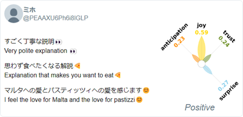

  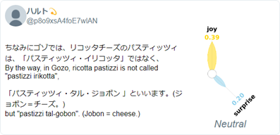

  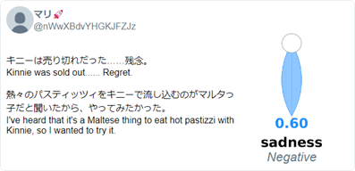
    
<em>Tweets about pastizzi were mostly positive, but the sentiments range. The Positive tweets commonly mention the snack’s rich ricotta filling and affordability, often reflecting a nostalgic longing to return to Malta for another taste. The Neutral tweets typically present factual observations, such as price and availability, without an enthusiastic endorsement. On the other hand, the Negative tweets highlight frustrations, such as availability issues or unmet expectations. The selected examples demonstrate divergence between general and aspectual sentiment analysis. Each tweet reflects a positive attitude towards pastizzi. The short-term visitor that authored the positive example relished the experience of connecting with a local. The neutral example’s explanation reflects respect for the culture and language. The negative example laments the missed opportunity to enjoy a classic snack pairing.</em>

### Tweets about NHK Broadcast on Online Casinos

  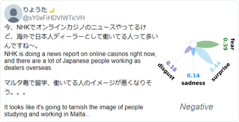

  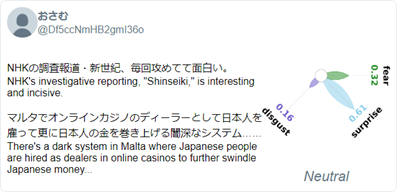

  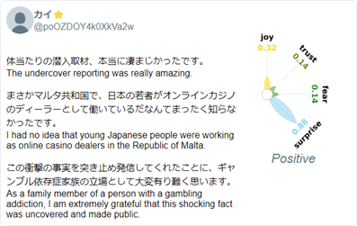
    
<em>Reactions to the NHK broadcast universally condemned online casinos. The Negative tweets focused on concerns over gambling addiction and fraud. Some commentors criticize Malta for enabling the industry. The Neutral offers a more balanced view, focusing on the factual details of NHK’s investigation, underlining the ethical dilemmas and regulatory challenges. The few Positive tweets praised the quality of reporting, expressing gratitude to NHK for educating the public about a little-known problem.</em>

  

## Sentiment Analysis of Tweets about Ai Fukuhara

The next exercise scales up the analysis, focusing on overarching features as well as the content of individual tweets. The aim is to validate the models by correlating fluctuations in public sentiment with real-world events (Barnaghi et al., 2016). This analysis focuses on Ai Fukuhara, a popular table tennis athlete. Fukuhara was beloved in her early years, captivating the public during her Olympic performances. Later in life, she became the subject of scandal. This analysis examines tweets about Fukuhara during this tumultuous period of her life.

The sentiment analysis includes four components. The plot below exemplifies the first output, a line plot that visualizes fluctuations in sentiment over time. Peaks are flagged and color-coded to highlight dates of interest. This exercise focuses on four days that varied in dominant sentiment. 

  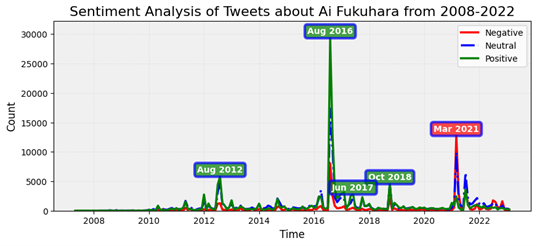
    
<em>These tweets were collected by querying Fukuhara’s name in kanji, 福原 愛. The corpus includes 1.2 million tweets from over 500,000 users. Strong positive peaks in the summers of 2012 and 2016 correspond to her Olympic performances. In the spring of 2021, the media exposed her marital problems and began to publish allegations of infidelity. This analysis focuses on public sentiment during this period of scandal, from January to September 2021.</em>

On each target day, tweets are clustered by sentiment, and two analyses are performed. First, emotional intensity scores are averaged and plotted for each sentiment class. If all systems function correctly, emotion and sentiment should align—such as joy and trust for positive sentiment, and disgust and fear for negative sentiment. The second analysis ranks unigrams using a TF-IDF score. The top-ranking terms provide context on the topic and characterize the unique vocabulary from each sentiment class. For qualitative analysis, thirty tweets were sampled for each day and sentiment. The samples were balanced by their dominant emotion to ensure variety. The captions provide context through a comparison of recurring themes by sentiment.

  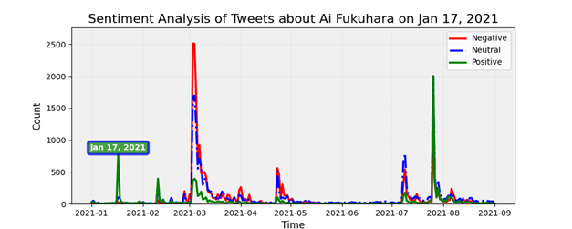

  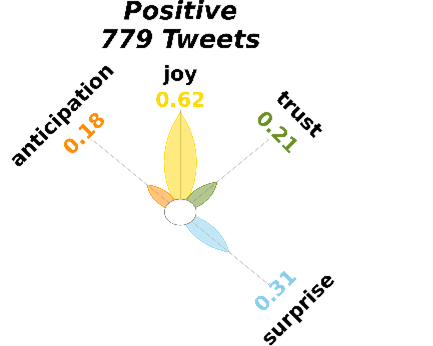
  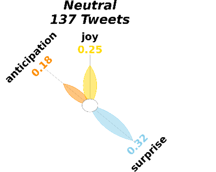
  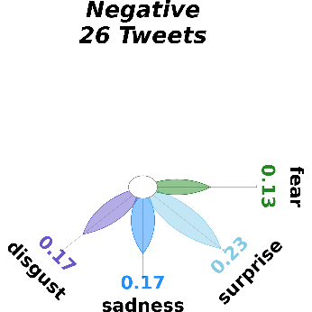

  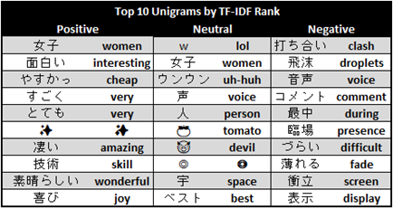
  
<em>On January 17, 2021, Fukuhara commentated on the television broadcast of the women’s division of a national table tennis tournament. Positive tweets congratulate the winners for their thrilling performance in an exciting series of matches. Fukuhara’s commentary is praised for being clear, insightful and engaging. Neutral tweets also commend Fukuhara but focus more on the broader tournament context. Recurring topics include COVID-19, player withdrawals, and the men’s competition. In contrast, Negative tweets criticize Fukuhara, citing issues such as talking too much, being distracting, or using poor analogies, with some suggesting that she ruined the experience.</em>

  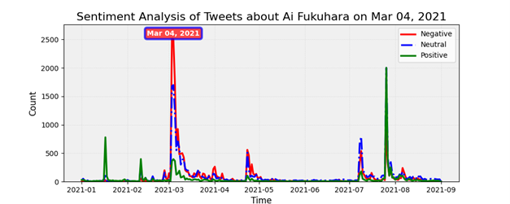

  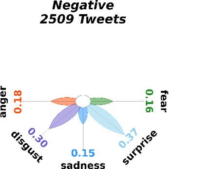
  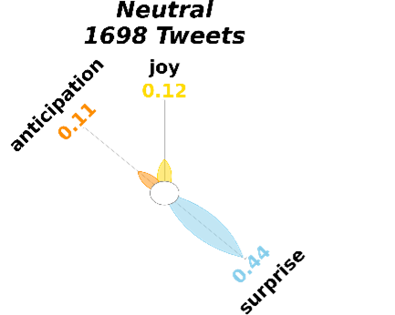
  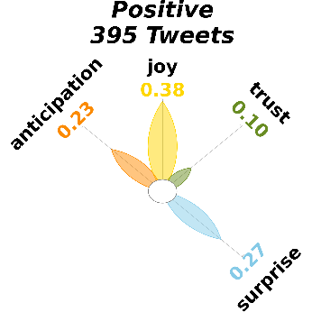

  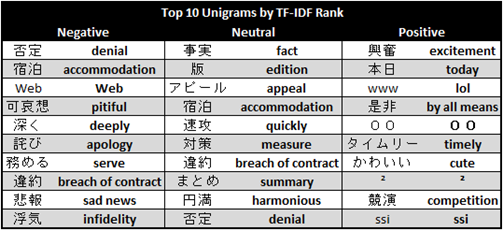
  
<em>On March 4, 2021, Twitter users reacted to media reports about Fukuhara that alleged marital stress and infidelity. Negative tweets primarily express shock, disappointment, and sadness. Many are supportive of Fukuhara, expressing concern about her family’s reputation and criticizing the invasion of her privacy. Neutral tweets also reflect mixed reactions, discussing the media's handling of the situation and its impact on her public image and personal life. Positive tweets, though varied, express excitement or amusement by the scandal. Some share personal anecdotes about events and locations that circumstantially connect the commentors with the scandal. Many were defamatory, garnering a positive classification by framing derogatory comments with symbols of laughter.</em>

  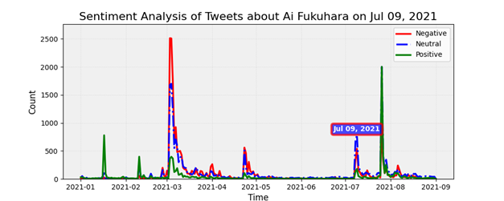

  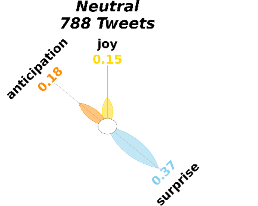
  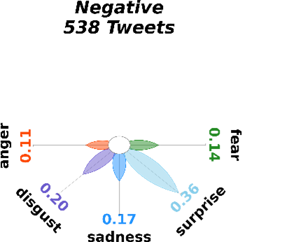
  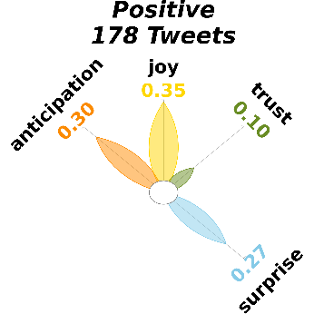

  
  
<em> On July 26, 2021, Fukuhara commentated on a dramatic table tennis match at the Tokyo Olympics where Japan won gold. The Positive tweets praise the performance of the winning duo. Many commend Fukuhara, complimenting her enthusiasm and strong presence despite her recent challenges. Overall, they emphasize joy and pride in Japan’s achievement and admiration for Fukuhara. The Neutral tweets are more mixed. Many acknowledge the historic gold medal win, but express discomfort about her presence. While the athletes are celebrated, Fukuhara’s presence tempers their excitement. The Negative tweets focus more on Fukuhara than the event. These tweets are blunt and critical, with some using derogatory language to express their dissatisfaction. They openly discuss her scandals, complain about her presence, and criticize organizers for including her.</em>

  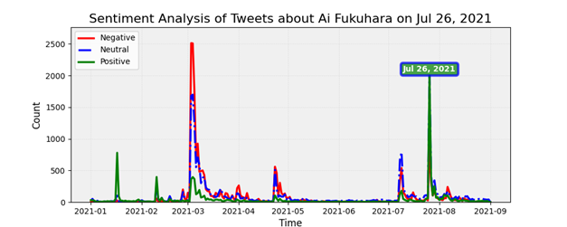

  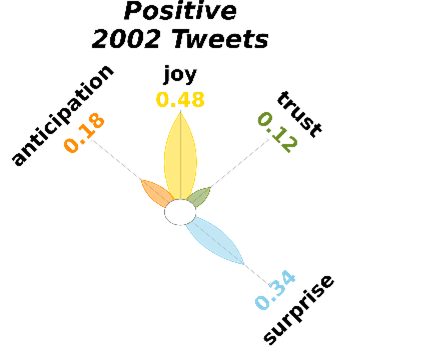
  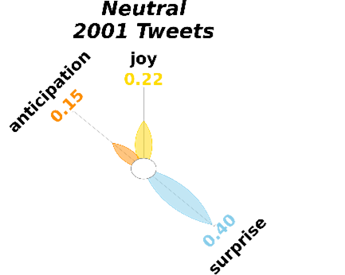
  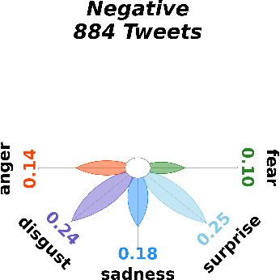

  
  
<em> On July 26, 2021, Fukuhara commentated on a dramatic table tennis match at the Tokyo Olympics where Japan won gold. The Positive tweets praise the performance of the winning duo. Many commend Fukuhara, complimenting her enthusiasm and strong presence despite her recent challenges. Overall, they emphasize joy and pride in Japan’s achievement and admiration for Fukuhara. The Neutral tweets are more mixed. Many acknowledge the historic gold medal win, but express discomfort about her presence. While the athletes are celebrated, Fukuhara’s presence tempers their excitement. The Negative tweets focus more on Fukuhara than the event. These tweets are blunt and critical, with some using derogatory language to express their dissatisfaction. They openly discuss her scandals, complain about her presence, and criticize organizers for including her.</em>

